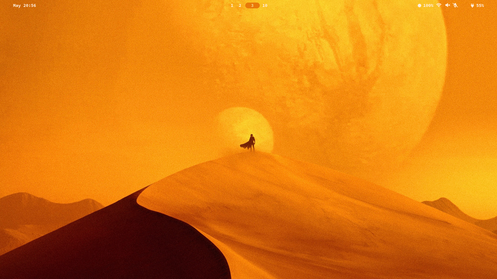
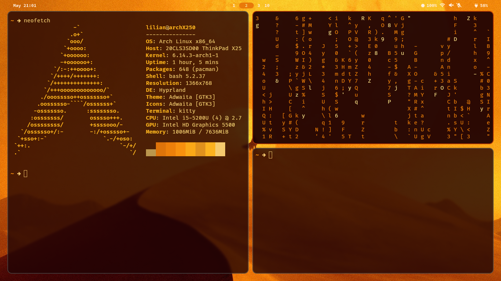
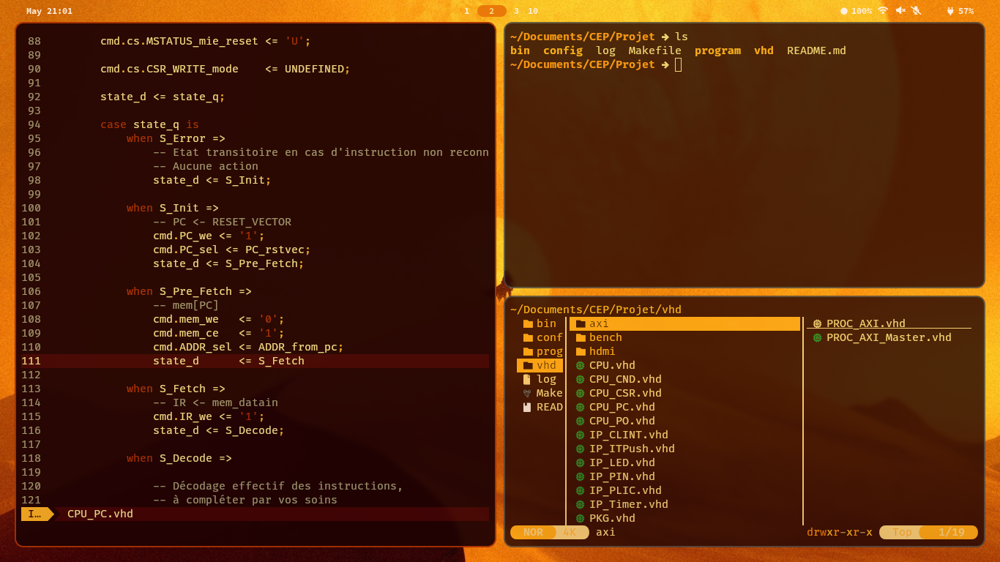
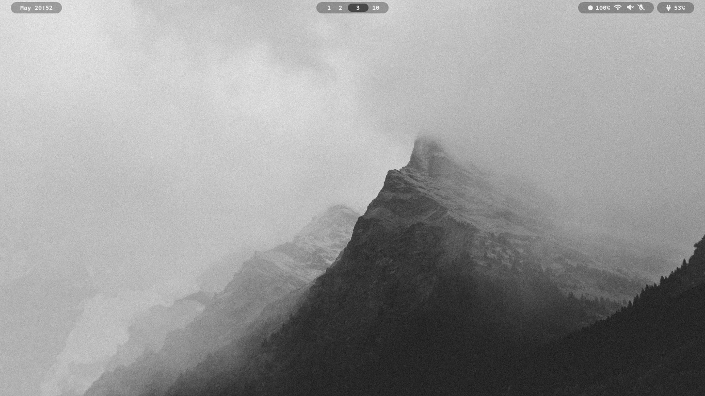
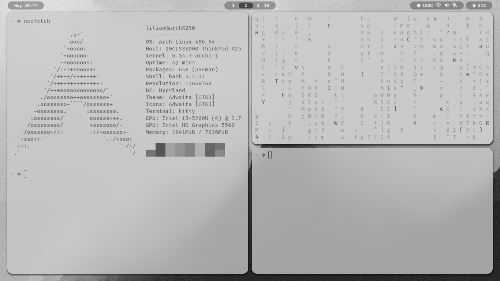
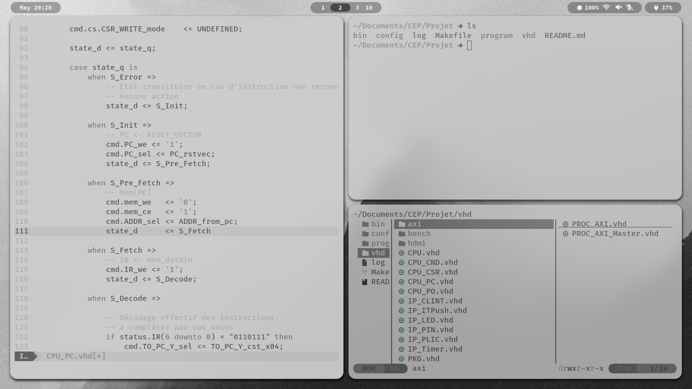

# Collection of handmade themes for hyprland

Some themes I made :D

Contains:
- config files for `hyprland`, `hyprpaper`, `hyprlock`, `waybar`, `kitty`, `dunst`, `zathura`, `wofi`, `bash`, `vim` ;
- colorscheme for `vim`.

## Installation

You should maybe make a backup of you config files first.

**NB** You might want to edit the paths in the `hyprpaper` config file, or put your wallpapers in `$HOME/Pictures/Wallpapers/` to make it work.

**NB** After setting-up the config files, you might need to restart some programs (`waybar` and `dunst` for instance). Easiest way to go by is to restart your computer altogether.

**DISCLAIMER** I just made this repo to share the config files but I am not qualified to solve every problem you may encounter. I just share what worked for me but I have not tested setting-up this config on other systems.

### Safe route

The safe way is to individually copy the directories in `.config` one by one in your own `.config` directory.

It's slow but that way you are sure to not overwrite any important config file you might want to keep.

### The fast way
Once you cloned this repo, just use:

```
cp -rf * $HOME
```

From what I tested, it is pretty safe, as `cp -rf` does not delete files but simply overwrites already existing files in target path. But you never know and I don't wanna be held accountable in case of a catastrophy.

## Preview

### Dune theme
Red and orange theme, inspired Villeneuve's Dune movies.

_Empty desktop_.

_neofetch (left), cmatrix (top right), kitty (bottom right)_.

_vim (left), kitty (top right), yazi (bottom right)_.

### White theme
White-and-black theme, inspired by e-ink themes.

_Empty desktop_.

_neofetch (left), cmatrix (top right), kitty (bottom right)_.

_vim (left), kitty (top right), yazi (bottom right)_.

## Miscellaneous

### Login page theme

I have my config files for `sddm` (the login page manager) ready but I haven't found the right way to include them in the package.

If you just want to know how in the world do you edit this ugly login screen, all you need is to search for "_sddm themes_".

[MarianArlt's](https://github.com/MarianArlt/sddm-sugar-dark)) and [Keyitdev's](https://github.com/Keyitdev/sddm-astronaut-theme/) repositories were my starting point (I copy-pasted most of it and just changed the background, colors, and positions).

### Expanding on the color theme

The terminal colors I used can be found inside the `kitty.conf` configuration file (`$HOME/.config/kitty/`), under the `Color scheme` section.

You can also go into `.vim/colors/[theme].vim` to find the base16 I use for `vim` (so you can apply it to your `vscode` config or something).

### Credits

The `vim` themes were generated using a base16 builder. You can find all the ressources related to this topic on [this repository](https://github.com/chriskempson/base16).

The `sddm` themes were created using [Keyitdev's work](https://github.com/Keyitdev/sddm-astronaut-theme/) as a starting point.

The background images are not mine.
